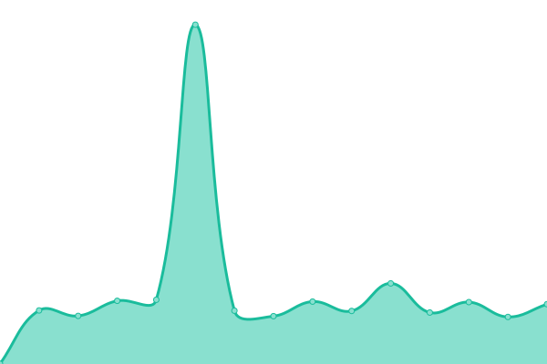

# [📈 Live Status](https://T-SOLUTION-VIETNAM-CORPORATION.github.io/tsolution-status-check-20230509): <!--live status--> **🟩 All systems operational**

This repository contains the open-source uptime monitor and status page for [T-SOLUTION-VIETNAM-CORPORATION](https://t-solution.vn), powered by [Upptime](https://github.com/upptime/upptime).

With [Upptime](https://upptime.js.org), you can get your own unlimited and free uptime monitor and status page, powered entirely by a GitHub repository. We use [Issues](https://github.com/T-SOLUTION-VIETNAM-CORPORATION/tsolution-status-check-20230509/issues) as incident reports, [Actions](https://github.com/T-SOLUTION-VIETNAM-CORPORATION/tsolution-status-check-20230509/actions) as uptime monitors, and [Pages](https://T-SOLUTION-VIETNAM-CORPORATION.github.io/tsolution-status-check-20230509) for the status page.

<!--start: status pages-->
<!-- This summary is generated by Upptime (https://github.com/upptime/upptime) -->
<!-- Do not edit this manually, your changes will be overwritten -->
<!-- prettier-ignore -->
| URL | Status | History | Response Time | Uptime |
| --- | ------ | ------- | ------------- | ------ |
|  [Beripharma](https://beripharma.com) | 🟩 Up | [beripharma.yml](https://github.com/T-SOLUTION-VIETNAM-CORPORATION/tsolution-status-check-20230509/commits/HEAD/history/beripharma.yml) | 

 9735ms
     
 | 

<a href="https://T-SOLUTION-VIETNAM-CORPORATION.github.io/tsolution-status-check-20230509/history/beripharma">99.57%</a>
    

|  [Maxhouse](https://maxhousevietnam.com) | 🟩 Up | [maxhouse.yml](https://github.com/T-SOLUTION-VIETNAM-CORPORATION/tsolution-status-check-20230509/commits/HEAD/history/maxhouse.yml) | 

 1837ms
     
 | 

<a href="https://T-SOLUTION-VIETNAM-CORPORATION.github.io/tsolution-status-check-20230509/history/maxhouse">99.94%</a>
    

|  [Trinix](https://trinix.studio) | 🟩 Up | [trinix.yml](https://github.com/T-SOLUTION-VIETNAM-CORPORATION/tsolution-status-check-20230509/commits/HEAD/history/trinix.yml) | 

 1449ms
     
 | 

<a href="https://T-SOLUTION-VIETNAM-CORPORATION.github.io/tsolution-status-check-20230509/history/trinix">99.52%</a>
    

|  [TPC](https://thaiphong.vn) | 🟩 Up | [tpc.yml](https://github.com/T-SOLUTION-VIETNAM-CORPORATION/tsolution-status-check-20230509/commits/HEAD/history/tpc.yml) | 

 1507ms
     
 | 

<a href="https://T-SOLUTION-VIETNAM-CORPORATION.github.io/tsolution-status-check-20230509/history/tpc">99.53%</a>
    

|  [ERP](https://erp.thehillcoffee.com) | 🟩 Up | [erp.yml](https://github.com/T-SOLUTION-VIETNAM-CORPORATION/tsolution-status-check-20230509/commits/HEAD/history/erp.yml) | 

 846ms
     
 | 

<a href="https://T-SOLUTION-VIETNAM-CORPORATION.github.io/tsolution-status-check-20230509/history/erp">99.53%</a>
    

|  [Member customer dev API](https://member-api.t-solution.vn/customer/swagger/) | 🟩 Up | [member-customer-dev-api.yml](https://github.com/T-SOLUTION-VIETNAM-CORPORATION/tsolution-status-check-20230509/commits/HEAD/history/member-customer-dev-api.yml) | 

 1060ms
     
 | 

<a href="https://T-SOLUTION-VIETNAM-CORPORATION.github.io/tsolution-status-check-20230509/history/member-customer-dev-api">99.35%</a>
    

|  [Member store dev API](https://member-api.t-solution.vn/store/swagger/) | 🟩 Up | [member-store-dev-api.yml](https://github.com/T-SOLUTION-VIETNAM-CORPORATION/tsolution-status-check-20230509/commits/HEAD/history/member-store-dev-api.yml) | 

 404ms
     
 | 

<a href="https://T-SOLUTION-VIETNAM-CORPORATION.github.io/tsolution-status-check-20230509/history/member-store-dev-api">99.35%</a>
    

|  [Member admin dev API](https://member-api.t-solution.vn/store/swagger/) | 🟩 Up | [member-admin-dev-api.yml](https://github.com/T-SOLUTION-VIETNAM-CORPORATION/tsolution-status-check-20230509/commits/HEAD/history/member-admin-dev-api.yml) | 

 197ms
     
 | 

<a href="https://T-SOLUTION-VIETNAM-CORPORATION.github.io/tsolution-status-check-20230509/history/member-admin-dev-api">99.36%</a>
    

<!--end: status pages-->

[**Visit our status website →**](https://T-SOLUTION-VIETNAM-CORPORATION.github.io/tsolution-status-check-20230509)

## 📄 License

- Powered by: [Upptime](https://github.com/upptime/upptime)
- Code: [MIT](./LICENSE) © [T-SOLUTION-VIETNAM-CORPORATION](https://t-solution.vn)
- Data in the `./history` directory: [Open Database License](https://opendatacommons.org/licenses/odbl/1-0/)
