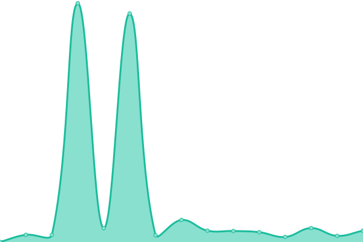

# [📈 Live Status](https://T-SOLUTION-VIETNAM-CORPORATION.github.io/tsolution-status-check-20230509): <!--live status--> **🟧 Partial outage**

This repository contains the open-source uptime monitor and status page for [T-SOLUTION-VIETNAM-CORPORATION](https://t-solution.vn), powered by [Upptime](https://github.com/upptime/upptime).

With [Upptime](https://upptime.js.org), you can get your own unlimited and free uptime monitor and status page, powered entirely by a GitHub repository. We use [Issues](https://github.com/T-SOLUTION-VIETNAM-CORPORATION/tsolution-status-check-20230509/issues) as incident reports, [Actions](https://github.com/T-SOLUTION-VIETNAM-CORPORATION/tsolution-status-check-20230509/actions) as uptime monitors, and [Pages](https://T-SOLUTION-VIETNAM-CORPORATION.github.io/tsolution-status-check-20230509) for the status page.

<!--start: status pages-->
<!-- This summary is generated by Upptime (https://github.com/upptime/upptime) -->
<!-- Do not edit this manually, your changes will be overwritten -->
<!-- prettier-ignore -->
| URL | Status | History | Response Time | Uptime |
| --- | ------ | ------- | ------------- | ------ |
|  [Maxhouse](https://maxhousevietnam.com) | 🟩 Up | [maxhouse.yml](https://github.com/T-SOLUTION-VIETNAM-CORPORATION/tsolution-status-check-20230509/commits/HEAD/history/maxhouse.yml) | 

 4522ms
     
 | 

<a href="https://T-SOLUTION-VIETNAM-CORPORATION.github.io/tsolution-status-check-20230509/history/maxhouse">100.00%</a>
    

|  [Trinix Backend](https://trinix-new.t-solution.vn) | 🟩 Up | [trinix-backend.yml](https://github.com/T-SOLUTION-VIETNAM-CORPORATION/tsolution-status-check-20230509/commits/HEAD/history/trinix-backend.yml) | 

 1226ms
     
 | 

<a href="https://T-SOLUTION-VIETNAM-CORPORATION.github.io/tsolution-status-check-20230509/history/trinix-backend">100.00%</a>
    

|  [TPC](https://thaiphong.vn) | 🟩 Up | [tpc.yml](https://github.com/T-SOLUTION-VIETNAM-CORPORATION/tsolution-status-check-20230509/commits/HEAD/history/tpc.yml) | 

 2197ms
     
 | 

<a href="https://T-SOLUTION-VIETNAM-CORPORATION.github.io/tsolution-status-check-20230509/history/tpc">99.89%</a>
    

|  [ERP](https://erp.thehillcoffee.com) | 🟩 Up | [erp.yml](https://github.com/T-SOLUTION-VIETNAM-CORPORATION/tsolution-status-check-20230509/commits/HEAD/history/erp.yml) | 

 130ms
     
 | 

<a href="https://T-SOLUTION-VIETNAM-CORPORATION.github.io/tsolution-status-check-20230509/history/erp">100.00%</a>
    

|  [Thehill Storefront](https://www.thehillstore.com.vn) | 🟩 Up | [thehill-storefront.yml](https://github.com/T-SOLUTION-VIETNAM-CORPORATION/tsolution-status-check-20230509/commits/HEAD/history/thehill-storefront.yml) | 

 8608ms
     
 | 

<a href="https://T-SOLUTION-VIETNAM-CORPORATION.github.io/tsolution-status-check-20230509/history/thehill-storefront">99.88%</a>
    

|  [Member customer API](https://member-customer-api.doidiem.vn/health/) | 🟩 Up | [member-customer-api.yml](https://github.com/T-SOLUTION-VIETNAM-CORPORATION/tsolution-status-check-20230509/commits/HEAD/history/member-customer-api.yml) | 

 1096ms
     
 | 

<a href="https://T-SOLUTION-VIETNAM-CORPORATION.github.io/tsolution-status-check-20230509/history/member-customer-api">100.00%</a>
    

|  [Member store API](https://member-store-api.doidiem.vn/health/) | 🟩 Up | [member-store-api.yml](https://github.com/T-SOLUTION-VIETNAM-CORPORATION/tsolution-status-check-20230509/commits/HEAD/history/member-store-api.yml) | 

 1074ms
     
 | 

<a href="https://T-SOLUTION-VIETNAM-CORPORATION.github.io/tsolution-status-check-20230509/history/member-store-api">100.00%</a>
    

|  [Member admin API](https://member-admin-api.doidiem.vn/health/) | 🟩 Up | [member-admin-api.yml](https://github.com/T-SOLUTION-VIETNAM-CORPORATION/tsolution-status-check-20230509/commits/HEAD/history/member-admin-api.yml) | 

 1055ms
     
 | 

<a href="https://T-SOLUTION-VIETNAM-CORPORATION.github.io/tsolution-status-check-20230509/history/member-admin-api">100.00%</a>
    

|  [Member version API](https://member-version-api.doidiem.vn/api/health) | 🟩 Up | [member-version-api.yml](https://github.com/T-SOLUTION-VIETNAM-CORPORATION/tsolution-status-check-20230509/commits/HEAD/history/member-version-api.yml) | 

 1013ms
     
 | 

<a href="https://T-SOLUTION-VIETNAM-CORPORATION.github.io/tsolution-status-check-20230509/history/member-version-api">100.00%</a>
    

|  [Black-red storefront](https://dendofish.com) | 🟩 Up | [black-red-storefront.yml](https://github.com/T-SOLUTION-VIETNAM-CORPORATION/tsolution-status-check-20230509/commits/HEAD/history/black-red-storefront.yml) | 

 3411ms
     
 | 

<a href="https://T-SOLUTION-VIETNAM-CORPORATION.github.io/tsolution-status-check-20230509/history/black-red-storefront">100.00%</a>
    

|  [Black-red back-end](https://admin.dendofish.com/health/) | 🟩 Up | [black-red-back-end.yml](https://github.com/T-SOLUTION-VIETNAM-CORPORATION/tsolution-status-check-20230509/commits/HEAD/history/black-red-back-end.yml) | 

 927ms
     
 | 

<a href="https://T-SOLUTION-VIETNAM-CORPORATION.github.io/tsolution-status-check-20230509/history/black-red-back-end">100.00%</a>
    

|  [Fnb storefront](https://fnb39.com) | 🟥 Down | [fnb-storefront.yml](https://github.com/T-SOLUTION-VIETNAM-CORPORATION/tsolution-status-check-20230509/commits/HEAD/history/fnb-storefront.yml) | 

 1240ms
     
 | 

<a href="https://T-SOLUTION-VIETNAM-CORPORATION.github.io/tsolution-status-check-20230509/history/fnb-storefront">0.00%</a>
    

|  [Fnb back-end](https://fnb-backend.t-solution.vn/health/) | 🟥 Down | [fnb-back-end.yml](https://github.com/T-SOLUTION-VIETNAM-CORPORATION/tsolution-status-check-20230509/commits/HEAD/history/fnb-back-end.yml) | 

 1043ms
     
 | 

<a href="https://T-SOLUTION-VIETNAM-CORPORATION.github.io/tsolution-status-check-20230509/history/fnb-back-end">49.04%</a>
    

<!--end: status pages-->

[**Visit our status website →**](https://T-SOLUTION-VIETNAM-CORPORATION.github.io/tsolution-status-check-20230509)

## 📄 License

- Powered by: [Upptime](https://github.com/upptime/upptime)
- Code: [MIT](./LICENSE) © [T-SOLUTION-VIETNAM-CORPORATION](https://t-solution.vn)
- Data in the `./history` directory: [Open Database License](https://opendatacommons.org/licenses/odbl/1-0/)
